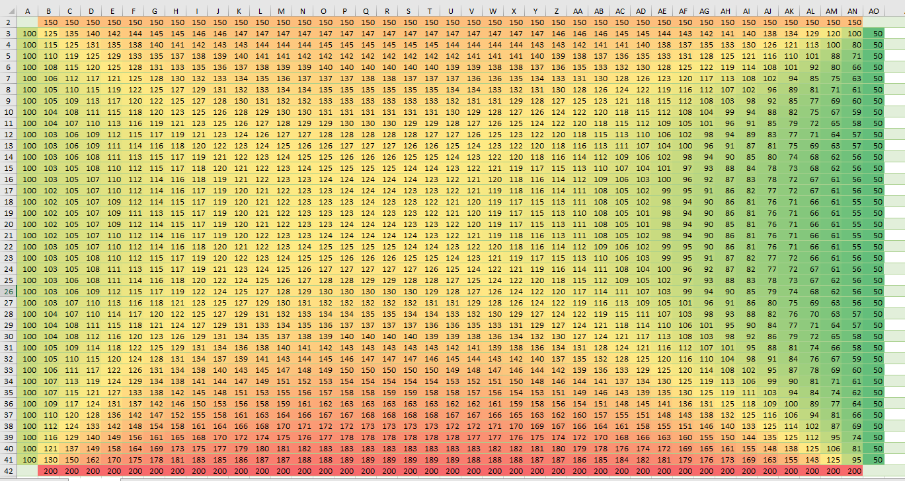
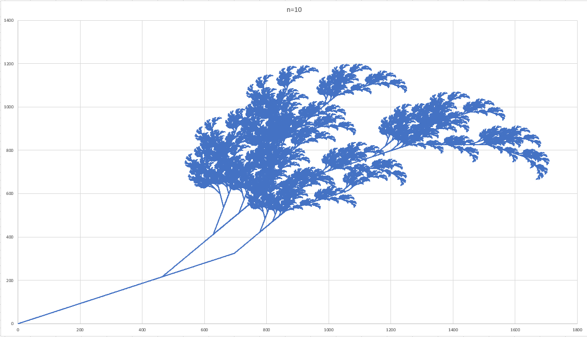
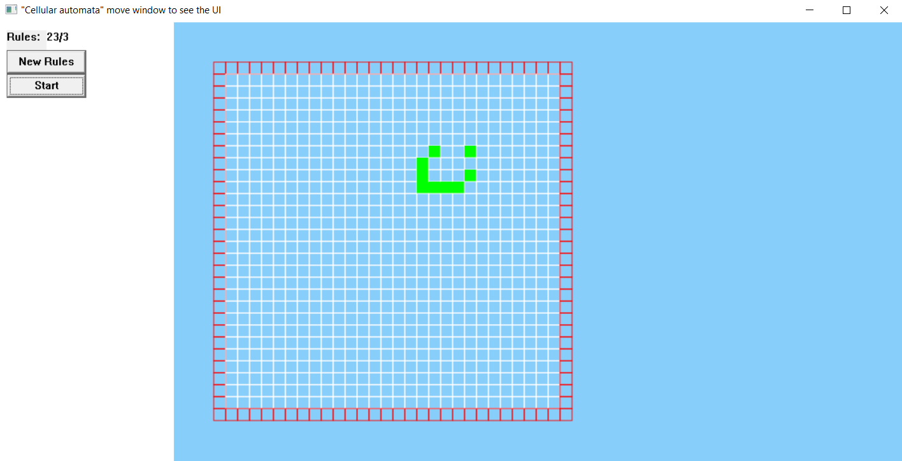

## PSM
# FCS - foundations of computer simulations

## (1)Implementation of sin function 
      using Taylor polynomial.

## (2)Simulating of a cannonball flight 
      using Mid-point method.
      Coordinates are output in the console.

## (3)Pendulum motion simulation
      using Runge-Kutta 4 method.
  
## (4)Rolling object on an inclined plane
      using Mid-point method.
  
## (5)Motion of Moon relative to the Sun
      using Mid-point method.

## (6)String propagation
      using Mid-point method.
  
## (7)Temperature distribution on a plane
      using Gaussian Elimination on matrix. 
      Rows and columns at the borders of the table are given by user.
  
        
## (8)L-System (growth of fractal plant)
  
  
## (9)Cellular Automata
  ### 1. Start
      1.1 For some reason GUI elements do not display when opening the application so you need to move the window in order to see them.
  ### 2. Rules
    2.0 To apply rules or draw the grid click NEW RULES button
	 2.1 Rules should be written in the following form rulesForLiving/rulesForDead. i.e. 23/3 that means in 
		order to survive cell needs 2 or 3 living neighbours and in order to become alive the dead cell needs 3 living neighbours.
	2.2 At any time you can change the rules during the use of program by modifying this text field and pressing NEW RULES button again.
	2.3 You need to make sure that rules are written in correct format or else the application will not work as expected.
### 3. Run the simulation
      3.0 Clicking start button starts the simulation.
	   3.1 In order to stop it click this button once again. The whole grid will remain the same untill you press the start again or restart     the program.
### 4. Modify cells value
      4.0 You can click on cells any time in order to change their mode (living/dead).
	   4.1 By click and drag you will modify several cells at once.
### 5. Cleaning grid
      5.0 The only way to clean the grid (make all dead) is to put 9/9 in the rules and apply them (probably other rules are also possible).
	By doing this all living cells will not be able to remain living any longer and this will dispell others from raising from the dead.
### 6. Quiting
      In order to quit use x sign at the top-right corner of window.
 

## (10)Monte-Carlo method
      Calculating square of integral from 0 to pi of sin(x)
